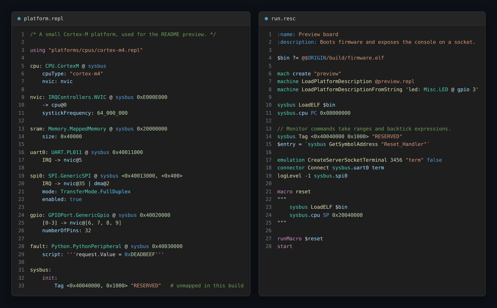

# Renode `.repl` / `.resc` for VS Code

Syntax highlighting, bracket matching, folding and snippets for
[Renode](https://renode.io/) files:

* **`.repl`** — platform descriptions (peripherals, registration points, IRQ wiring)
* **`.resc`** — Renode Monitor scripts



The extension is purely declarative: two TextMate grammars, two language
configurations and two snippet sets. There is no activation code, no language
server and no dependency on a local Renode install.

The grammars are validated against **every `.repl` and `.resc` file in
[renode/renode](https://github.com/renode/renode)** — 231 platform
descriptions and 137 scripts — and classify 100% of the tokens in them. See
[Validating against real files](#validating-against-real-files).

## Features

### `.repl` — platform descriptions

```repl
/* Block comments are supported, as used in upstream platform files. */

timer: Timers.ARM_GenericTimer @ cpu
    frequency: 100_000_000
    EL3PhysicalTimerIRQ->gic#0@29        // connector index, then IRQ line

spi: SPI.MyController @ sysbus <0x40013000, +0x1000>
    IRQ -> nvic@35 | dma@2 | dma@4       // several destinations
    mode: TransferMode.FullDuplex

rstgen: Python.PythonPeripheral @ sysbus 0x11840000
    script: '''
request.Value = 0xFFFFFFFF               # highlighted as Python
'''
```

| Construct | Example |
| --- | --- |
| Entry declarations | `uart0:` gets its own scope, distinct from the type |
| Qualified type names | `UART.PL011`, `IRQControllers.NVIC` |
| Registration points | `@ sysbus 0x40011000`, `@ none` |
| Address ranges | `<0x40013000, +0x1000>` |
| Multi-registration blocks | `@ { sysbus 0x40010000; spiBridge1 }` |
| `new` registration objects | `new Bus.BusMultiRegistration { address: 0x8000000; size: 0x10000 }` |
| IRQ connections | `-> nvic@5`, `IRQ -> nvic@35`, `[0-3] -> nvic@[5, 5, 6, 6]` |
| Connector indices | `gic#0@29`, `gic#0x1@30` |
| Multiple destinations | `IRQ -> nvic@35 \| dma@2 \| dma@4` |
| Hex IRQ lines | `RxDataAvailableRequest -> ldma@0x0040` |
| Properties | `size:`, `cpuType:`, `systickFrequency:` |
| Numbers | `0x`, `0b`, decimal, negative, and digit separators (`100_000_000`) |
| Enum values | `TransferMode.FullDuplex`, multi-segment, and the `.GICv3` shorthand |
| Nested lists | `invertedAFPins: [[1, 5], [7, 2]]` |
| `using` directives | `using "a.repl" prefixed "pfx_"` |
| `init:` / `reset:` blocks | including `init add:`, `silent=true` keyword args and `#` comments |
| Monitor expressions | ``PC `syscon ResetVector` `` |
| Embedded Python | `script: '''…'''` bodies go to VS Code's Python grammar |
| Comments | `//` to end of line, `/* … */` blocks |

`#` is context-sensitive and handled accordingly: it is a connector index in
`gic#0@29` but a comment in `SilenceRange <0x82003000 0x200> # ddrphy`.

Because `.repl` is indentation-sensitive, the extension also enables
indentation-based folding, auto-indent after an entry declaration, and
`<`/`>`, `{`/`}`, `[`/`]` bracket matching.

### `.resc` — Monitor scripts

```resc
:name: Demo board
:description: Sample script.
:continuation lines start with a colon too

$bin?=@$ORIGIN/firmware/app.elf

mach create "demo"
machine LoadPlatformDescriptionFromString 'dma: CoSimulated.Peripheral @ sysbus <0x43c20000, +0x100>'
sysbus.cpu PC 0x08000000
$id = `next_value 1`
```

| Construct | Example |
| --- | --- |
| Script metadata | `:name:`, `:description:`, and continuation lines starting with `:` |
| Comments | `#` and `//` to end of line |
| Variables | `$bin`, plus `$ORIGIN` / `$CWD` as language variables |
| Assignment | `=` and the conditional `?=` |
| Path arguments | `@platforms/…`, `@$ORIGIN/app.elf`, and bare `$ORIGIN/../x.data` |
| Strings | double-quoted, single-quoted, and `"""…"""` blocks |
| Built-in objects | `sysbus`, `machine`, `mach`, `emulation`, `connector`, `cpu`, `host`, … |
| Peripheral paths | `sysbus.uart0` and custom roots like `twi0.lsm9ds1_imu` |
| CPU registers | `cpu PC 0x…`, `cpu SP 0x…` |
| Commands | `start`, `pause`, `include`, `using`, `runMacro`, `showAnalyzer`, `logLevel`, … |
| Method calls | `LoadELF`, `StartGdbServer`, and custom ones like `SetControllerPort` |
| Address ranges | `sysbus Tag <0x40080000 0x400> "RADIO"` |
| Monitor expressions | ``cpu VectorTableOffset `sysbus GetSymbolAddress "vectors"` `` |
| Macros | `macro reset` names the macro; commands inside `"""…"""` stay highlighted |
| Inline platform fragments | `LoadPlatformDescriptionFromString` bodies are highlighted **as `.repl`** |
| Embedded Python | `python """…"""` bodies go to VS Code's Python grammar |

Single-letter Monitor aliases (`s`, `p`, `q`, `i`, `h`, `e`) are only treated as
commands at the start of a line, so they are not highlighted as arguments.

### Snippets

Type the prefix and press <kbd>Tab</kbd>.

`.repl`: `periph`, `periphrange`, `multireg`, `cpum`, `cpuriscv`, `nvic`, `mem`,
`irq`, `using`, `usingprefixed`, `init`

`.resc`: `resc` (full script skeleton), `mach`, `loadelf`, `loadbin`, `macro`,
`uartsocket`, `uartpty`, `analyzer`, `gdb`, `loglevel`, `include`

## Installing

### From a packaged VSIX

```bash
npm install
npx @vscode/vsce package
code --install-extension renode-repl-resc-0.2.0.vsix
```

### For development

Clone the repository and open it in VS Code, then press <kbd>F5</kbd> to launch
an Extension Development Host. Open `samples/demo.repl` or `samples/demo.resc`
to see every supported construct at once.

To iterate on the grammars, run **Developer: Inspect Editor Tokens and Scopes**
from the Command Palette — it shows the exact scope applied at the cursor.

## Testing

Unit tests tokenize snippets with the same libraries VS Code itself uses
(`vscode-textmate` + `vscode-oniguruma`) and assert on the resulting scopes:

```bash
npm install
npm test
```

### Validating against real files

Scope assertions only prove the constructs someone thought to write a test for.
The broader check tokenizes a real Renode checkout and reports every token the
grammars leave unclassified — an unclassified token means a rule stopped
matching real syntax:

```bash
git clone --depth 1 --filter=blob:none --sparse https://github.com/renode/renode /tmp/renode
git -C /tmp/renode sparse-checkout set platforms scripts

npm run corpus -- /tmp/renode          # ranked report, exits non-zero on gaps
RENODE_CORPUS=/tmp/renode npm test     # same check as a test case
```

This is how the grammars were built: the first pass left 2.2% of `.repl` tokens
unclassified, and the report is what surfaced connector indices (`gic#0@29`),
`|`-separated destinations, `/* … */` comments, `'''` Python blocks, digit
separators, the `.GICv3` enum shorthand and context-sensitive `#`. Both file
types now sit at 0 unclassified tokens.

The same scan works on your own files — point it at a directory of in-house
platform descriptions and scripts to find anything this extension does not yet
cover, then open an issue with the report.

## Regenerating the preview image

`images/preview.png` is generated from `samples/preview.repl` and
`samples/preview.resc`, tokenized with this extension's grammars and coloured
with the real VS Code Dark+ theme through `vscode-textmate`'s own theme
matcher, so it cannot drift from what the editor shows:

```bash
npm run preview                    # writes images/preview.html
npm run preview -- --png images/preview.png   # also writes the PNG (needs Playwright)
```

## Theming notes

The grammars use standard TextMate scope names (`entity.name.class`,
`variable.other.property`, `keyword.operator.*`, `constant.numeric.*`, …), so
any theme colors them without extra configuration. To override a specific
scope, add to your `settings.json`:

```jsonc
"editor.tokenColorCustomizations": {
  "textMateRules": [
    {
      "scope": "entity.name.function.peripheral.renode-repl",
      "settings": { "foreground": "#4EC9B0", "fontStyle": "bold" }
    }
  ]
}
```

Every scope ends in `.renode-repl` or `.renode-resc`, so they can be targeted
without affecting other languages.

## Limitations

* This is a syntax-highlighting extension. It does not validate platform
  descriptions, resolve peripheral type names against a Renode build, or
  complete C# peripheral properties — Renode itself remains the source of truth
  for whether a `.repl` is correct.
* Embedded Python inside `'''…'''` and `python """…"""` relies on VS Code's
  built-in Python grammar. If that grammar is unavailable the block falls back
  to plain string highlighting.
* A `"""…"""` block assigned to a variable (`$plat = """…"""`) is highlighted as
  Monitor commands, since its contents cannot be told apart from a macro body
  until it is used. Passing the fragment directly to
  `LoadPlatformDescriptionFromString` highlights it as `.repl`.

## License

MIT — see [LICENSE](LICENSE).
